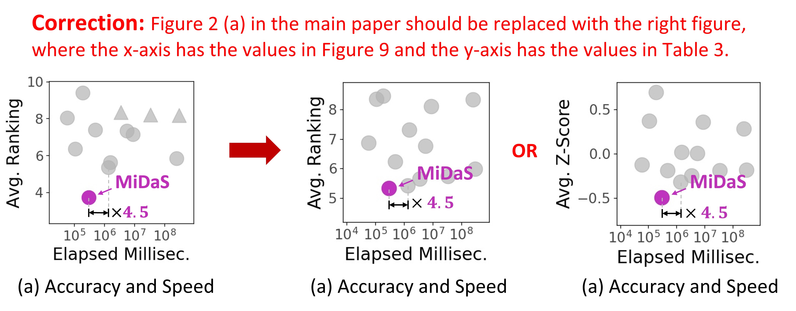

# MiDaS: Representative Sampling from Real-world Hypergraphs



- - -

We provide source code for, 

(1) **Sampling Hypergraphs**
* *Simple and Intuitive Approaches* : six intuitive approaches(RNS, RDN, RW, FF, RHS, TIHS) experimenting on 11 datasets with a focus on their limitations in preserving 10 properties
* *MiDaS-Basic* : a preliminary version of MiDaS which can improve the limitations of intuitive approaches by proper alpha setting
* *MiDaS*: a full-fledged version which can automatically tune alpha

(2) **Evaluating the Quality of Sub-Hypergraph**

Measure how precisely the sub-hypergraph preserves the structural properties of the entire hypergraph with respect to,

* *node-level statistics*: the distributions of node degrees and node-pair degrees
* *hyperedge-level statistics* : the distributions of hyperedge sizes and intersection sizes
* *graph-level statistics* : average clustering coefficient, density, overlapness, and effective diameter

(3) Reproducing *all* figures in the main paper

## Datasets

In the papaer, we used datasets after removing duplicated hyperedges. We preprocessed thirteen datasets collected We preprocessed datasets collected by [Austin R. Benson][https://www.cs.cornell.edu/~arb/]. The datasets used in the paper are available in the "dataset" folder.

## How to Run

#### Example
You can run all thirteen sampling algorithms including MiDaS by

```
./run_sampling.sh
```

#### Sampling
* src/main.cpp
after `make`, type `./bin/Sampling arguments`
```
required arguments:
  --algorithm ALGORITHM       --algo_opt  ALGORITHMOPTION: choose one of the below
              es                          [ global_deg_min / global_deg_max / global_deg_avg ]: for MiDaS_Basic or Random Hyperedge Sampling(RHS) / MiDaS_Basic_Max / MiDaS_Basic_Avg
              ns                          [ global_deg ]: for Random Node Sampling(RNS) and Random Degree Node(RDN)
              rw                          [ rw_c ]: for RandomWalk(RW)
              ff                          [ ff_c ]: for ForestFire(FF)
              mgs                         [ add / exchange / remove ]: for Metropolis Graph Sampling Add / Replace / Delete
              answer                      [ - ]: compute properties of dataset (Degree, Size, Pair Degree, Int. Size, SV, CC, GCC, Density, Overlapness, Diameter)
              find_skewness               [ - ]: compute skewness of the degree distribution of dataset
              test_dynamic                [ - ]: test code for dynamic updating the distributions of node degrees, hyperedge sizes, node-pair degrees, hyperedge-pair intersection sizes
              adjust_time                 [ - ]: calculate the additional elapsed time for computing the D-Statistics in degree distributions
              cal_phi_dist                [ - ]: observe theorem 2
  --dataname DATA: dataset file name
  --inputpath INPUTPATH: path for the directory of the dataset
  --target_portion PORTION: sampling portion
  --eval_opt EVAL: [degree/avg] When running mgs, choose degree if you aim to preserve node degrees. On the other hand, choose avg if you aim to 
                                preserve node degrees, hyperedge sizes, node-pair degrees and hyperedge intersection sizes at the same time.
  --repeat REPEAT: the order of repeating

optional arguments depending on ALGORITHM:
  ALGORITHM
  es or ns      --alpha ALPHA: the degree of bias towards those with high-degree nodes
  mgs           --turn TURN: the number of iterations for MGS-DT
  rw            --maxlength MAXLENGTH --restart RESTART: MAXLENGTH for the maximum number of steps and RESTART for restart probability
  ff            --p P --q Q: p and q for the parameters same in HyperFF
  test_dynamic  --num_tries NUMTRIES: the number of iterations
```
* analyze/midas.py

* analyze/ablation.py


#### Find Properties
* helper.py
```
python helper.py
```

* analyze_sv.py
```
python analyze.py
```
For large datasets(threads and coauth domain),

#### Plot Figures
* analyze_result.py
* draw_figures.py
* observation.py
* time_eval.py
* ablation_study.py
* theorem_plot.py

## Environment

The environment of running codes is specified in `environment.yml`
